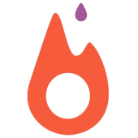
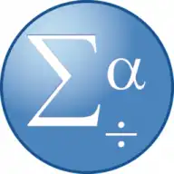
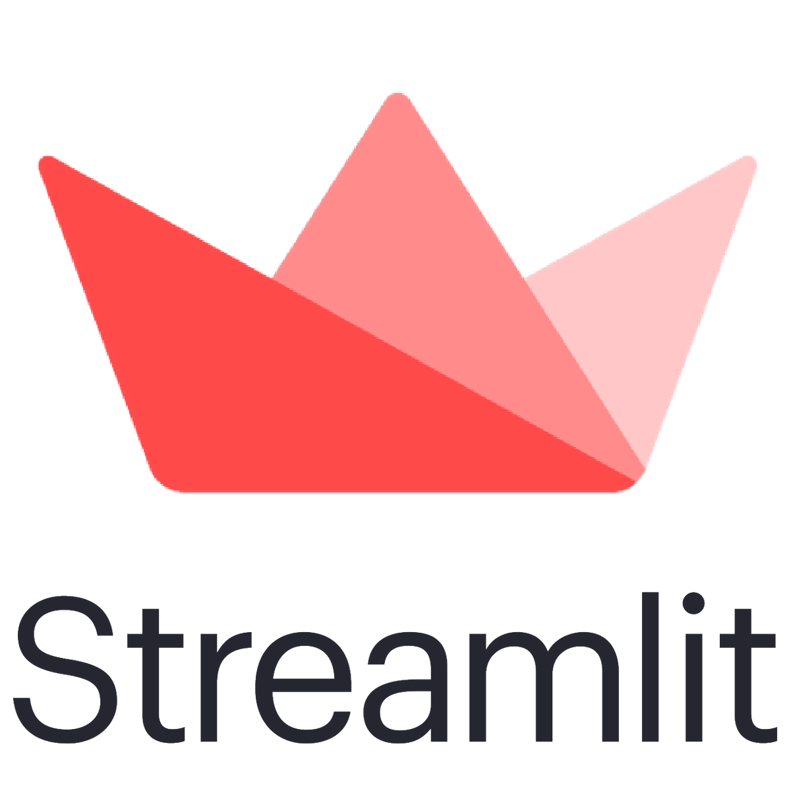

   

- 🏫 I’m currently working as a Data Scientist at [Sleep and Cognition Laboratory][workwebsite] ​🛌​💤​🧠​, National University of Singapore! <!-- - ⭐ I'm an aspiring Data Scientist! -->
- 🌱 I’m currently learning everything (AI, machine learning, deep learning, NLP, etc) 🤣
- 🥅 2023 Goals: Learn and implement end-to-end MLOps with CI/CD/CM and NoSQL (MongoDB)
- ⚽ Fun fact: My passion is playing football and flying drones!

### Connect with me:

[][website]
[][linkedin]
[][kaggle]

 

### Languages and Tools:

 

    

### Featured projects:

[website]: https://teyang-lau.github.io/
[linkedin]: https://www.linkedin.com/in/teyang-lau/
[kaggle]: https://www.kaggle.com/teyang
[workwebsite]: http://www.cogneuro-lab.org/DynamicPage.aspx?u=1
